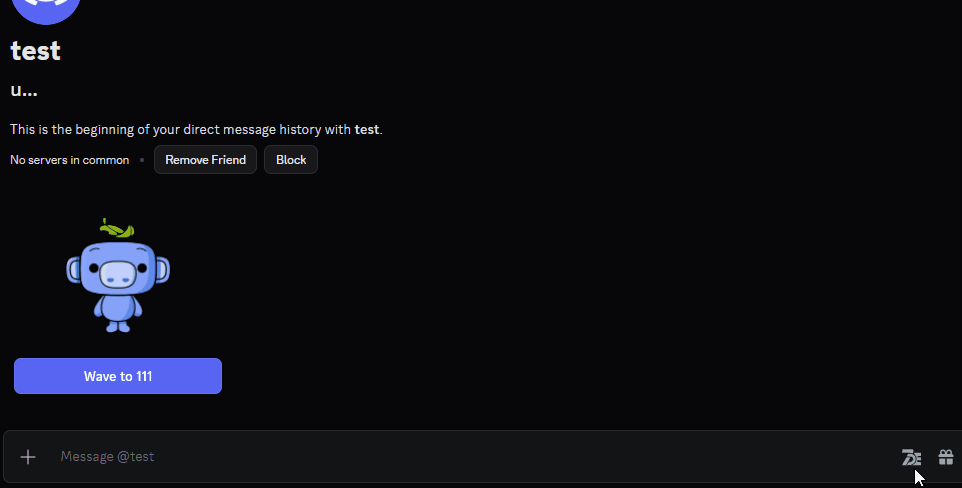
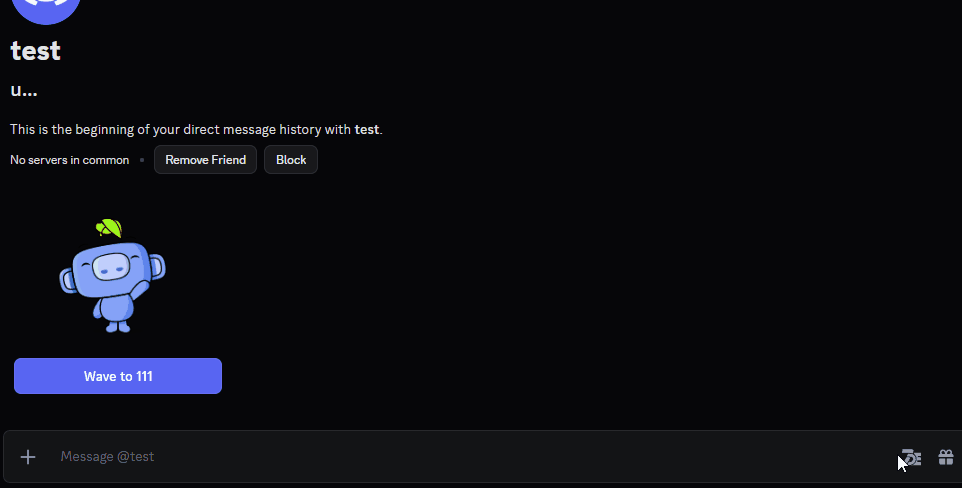
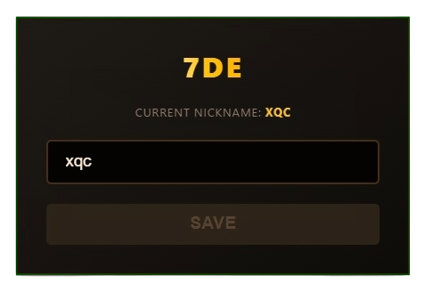

  

<h1 align="center">7DE - 7TV Discord Emotes</h1>

  
  
  

  <i>A lightweight extension to find and send 7TV emotes in Discord Web.</i>

  
  
<i>demo (v1.1.0): Global Search</i>

## What's New
- **Global Search:** Find any emote from the massive 7TV library, not just the local channel.
- **Visual Overhaul:** New "Golden-Orange" theme to match the new brand identity.

## How it works
When you select an emote from the 7DE menu, the extension **automatically inserts** the emote URL into the chat input and **sends the message**. Discord’s **Link Preview** handles the rest, rendering the URL as an image.

## Features
- **Global Search:** Search the entire 7TV emote library.
- **Dual Search Mode:** Switch between local channel emotes and Global 7TV search.
- **One-Click Send:** Instant url-emote delivery to the chat.
- **Size Selector:** Choose between 1x, 2x, 3x, or 4x scaling.
- **Native Integration:** Minimalist button added directly to the Discord toolbar.

<i>demo (v1.1.0): Local Channel Search</i>

> **Technical Note:**
> Emote rendering depends on **local user settings**. If someone has **Link Previews** disabled in Discord, they will only see the raw link instead of the image.

## Installation
1. Download the latest version from [Releases](../../releases).
2. Extract the archive.
3. Open Chrome and go to `chrome://extensions/` (or Edge: `edge://extensions/`).
4. Enable **Developer mode**.
5. Click **Load unpacked**.
6. Select the extracted folder (7DE/).

## Usage
1. Click the **7DE extension** icon in your browser toolbar to set your default channel.

2. In Discord, open any chat and click the **7DE button** in the message box.
3. Search for an emote and click it to send.

## Potential Issues
- **Discord Updates:** If the button disappears or stops working, Discord likely updated its internal UI classes.

## Disclaimer
**7DE** is an unofficial community project. It is not affiliated with, authorized, or endorsed by **Discord Inc. or 7TV.**