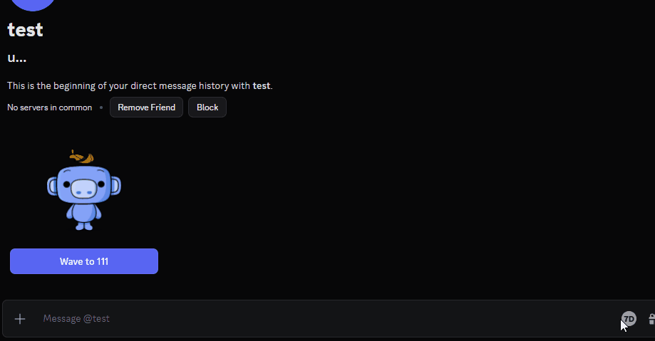
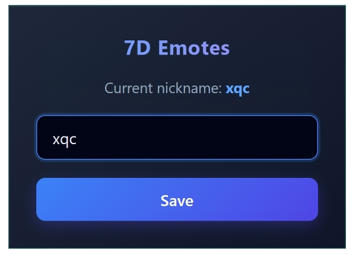

  

<h1 align="center">7D - 7TV Emotes for Discord</h1>

  
  
  

  <i>A lightweight extension to find and send 7TV emotes in Discord Web using Link Previews.</i>

  
  
<i>demo (v1.0.0)</i>

## How it works
When you select an emote from the 7D menu, the extension **automatically inserts** the emote URL into the chat input and **sends the message**. Discord’s built-in **Link Preview** then handles the rest, rendering the URL as an image.

## Features

- Browse and send 7TV emotes directly in Discord
- Seamlessly inserts emote URLs into the chat box 
- Search emotes by name
- Choose emote size (1x / 2x / 3x / 4x)
- Dynamic emote reload when changing the target channel
- Adapts to any Discord theme

> **How it works & Limitations:**
> - Emote rendering depends on local user settings. If someone has **Link Previews** disabled in Discord, they will only see the raw link instead of the image.
> - Emotes are loaded from a specific target channel. Global 7TV emote search is currently not supported.

## Installation

### Option 1 - Release (recommended)

1. Download the latest version from [Releases](../../releases)
2. Extract the archive
3. Open `chrome://extensions/` (or `edge://extensions/`)
4. Enable **Developer mode**
5. Click **Load unpacked** → select the extracted folder

### Option 2 - Build from source

1. Clone the repo
2. Run `npm install`
3. Run `npm run build`
4. Open `chrome://extensions/` (or `edge://extensions/`)
5. Enable **Developer mode**
6. Click **Load unpacked** → select the `dist` folder

## Usage

1. Click the extension icon.
2. Enter a Twitch nickname and press **Save**.

3. Open any Discord chat.
4. Click the **7D** button in the message toolbar.

## Potential Issues

- **UI changes breaking the extension:** Discord occasionally updates its internal CSS classes and chat box mechanics. Because of this, the 7D button **might temporarily disappear**, or emotes **might stop inserting** into the chat. If you notice this happening, it's likely due to a Discord update.

## Disclaimer

**7D Emotes** is an unofficial, community-made extension. It is not affiliated with, associated with, authorized, maintained, or in any way officially connected with **Discord Inc.** or **7TV**.
